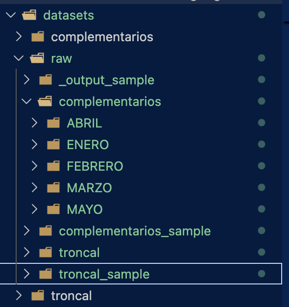

# Metropolitano Project

This project will aggregate the daily metropolitan (complementarios service) in Lima city in months.

To execute the project do the following

1. Install the library requeriments: `conda install requeriments.txt`
2. Move the folders of daily files to `datasets/raw` folder
3. Execute `npm run git-upload` to upload the aggregated in github repo.

## Scope

The trips were required to ATU, the Peruvian Transport entity who deliver me an [azure bucket](https://atugobpe.sharepoint.com/sites/DocumentosExternosSSTR/Documentos%20compartidos/Forms/AllItems.aspx?id=%2Fsites%2FDocumentosExternosSSTR%2FDocumentos%20compartidos%2FSSTR%20%2D%20UFAU%20%2D%20EXTERNO%2F7%29%20JULIO%20%2D%20SAIP%2FExp%2E%20N°4950%2D2025%2D02%2D0006762%20%2D%20CARLOS%20ALBERTO%20LEON%20LIZA&p=true&ga=1), where i can find the xls daily files. Data corresponds from January to May 25.

>[!NOTE]
>If you have problems to access the link please, require your own to ATU and move the files to `datasets/raw` folder. The raw dataset folder may look like this:


## Exporting files into Github

The `src/aggregate.py` script has the following features:

- The script reads daily `xlsx` files of each month (subfolder) and converts into a `csv.gz` compressed file month by month
- By default the script has the hability to process all the folders, but can also process a single subfolder entering the parameter **--month** like `src/converter.py --month JULIO`.
- You can use `npm run git-upload` to automate the process, see `package.json` file.
- The output aggregated files will be stored in `datasets/processed` folder, with the following structure:

```datasets
  ├── complementarios
          ├── complementarios_tripdata_2025_01.csv.gz
          ├── complementarios_tripdata_2025_02.csv.gz
          ├── complementarios_tripdata_2025_03.csv.gz
          ├── complementarios_tripdata_2025_04.csv.gz
          └── complementarios_tripdata_2025_05.csv.gz
```
